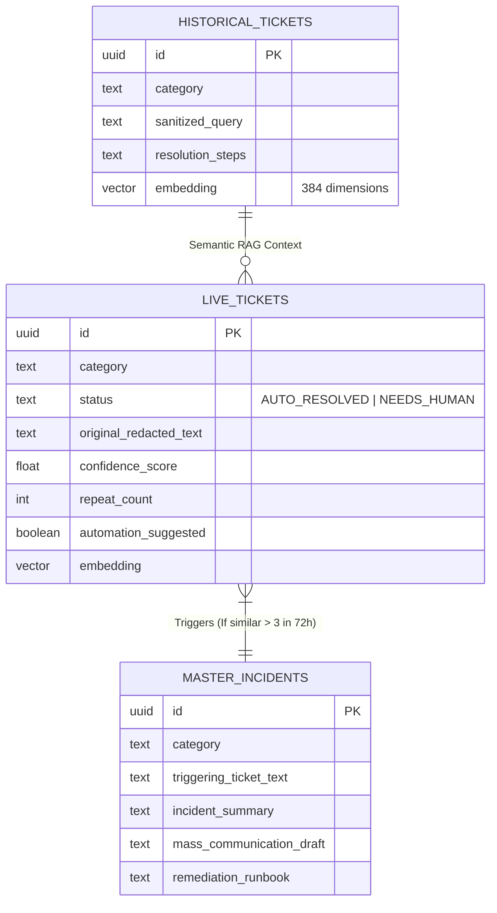
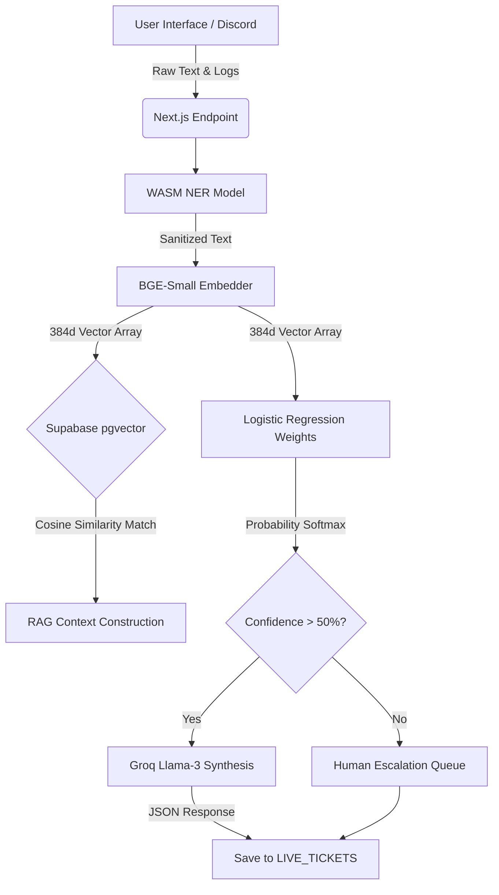
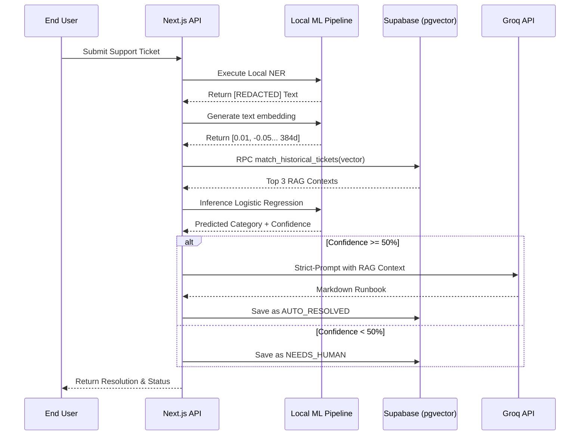
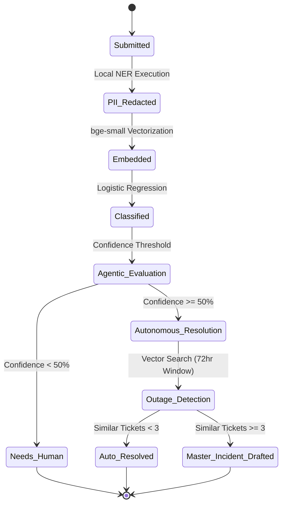

# Project Description: Agentic Enterprise IT Helpdesk (Zero-Trust L1 Agent)

## 1. Detailed Proposed Solution Architecture & Components
Our solution is a **Zero-Trust Agentic IT Helpdesk** designed to automate 80% of L1 support tickets while mathematically guaranteeing data privacy and gracefully handling offline environments. 

The architecture is uniquely separated into three layers:
1. **The Edge Compute Layer (Client/API):** Built on Next.js 14. This layer intercepts raw user input (via web or Discord) and instantly runs an embedded WebAssembly pipeline (Xenova Transformers). Before data ever leaves the server, it performs **Local Named Entity Recognition (NER)** to scrub PII (Names, IPs, SSNs) and generates 384-dimensional text embeddings locally using `BAAI/bge-small-en-v1.5`.
2. **The "Air-Gapped" Intelligence Layer:** A custom-trained **Logistic Regression Classifier (C=100.0, Softmax)** runs completely natively in the Node.js backend using raw matrix multiplication. If the confidence score is `< 50%`, the system automatically bypasses the LLM and routes to human engineers, preventing AI hallucinations.
3. **The Autonomous Data & Synthesis Layer:** Embeddings are cross-referenced using Cosine Similarity against a `pgvector` enabled **Supabase PostgreSQL** database. The closest `#1` historical resolution is either served deterministically (in offline/air-gapped mode) or dynamically synthesized by **Groq (Llama-3.3-70b)** (in cloud-connected mode) under strict anti-hallucination guardrails.

## 2. Low Level Design (LLD)
### Component Interaction:
- `POST /api/process-ticket`: The monolithic orchestrator.
  - **Step 1:** Upstash Redis sliding window rate-limiting.
  - **Step 2:** `Xenova/bert-base-NER` detects entities; fallback regex masks IP/Emails.
  - **Step 3:** `bge-small` creates a 384d `embeddingArray`.
  - **Step 4:** `match_historical_tickets` Supabase RPC executes `<=>` cosine distance vector search.
  - **Step 5:** `lr_model.json` matrices are multiplied against the embedding to yield a Softmax probability (Confidence).
  - **Step 6:** If Confidence `>= 0.50`, Llama 3 synthesizes a response constrained *only* to the retrieved RAG context.
  - **Step 7 (Agentic Trigger):** The `count_similar_live_tickets_vector` RPC checks if `count >= 3` in 72 hours. If true, the system halts and automatically drafts a `master_incidents` mass-communication outage runbook.

## 3. Various Data Sources & Data Engineering Steps
**Primary Data Source:** 
We engineered a proprietary synthetic dataset containing **1,304 unique enterprise IT support tickets**. 
- 1,000 tickets represent complex, highly technical infrastructure issues (e.g., PostgreSQL deadlocks, Docker CrashLoops).
- 304 tickets represent simple, mundane requests (e.g., forgotten passwords, printer jams) generated via LLM prompt engineering.

**Data Engineering Pipeline:**
1. **Generation:** `llama-3.3-70b` generates high-variance JSON tickets.
2. **Sanitization:** Scripts parse JSON to CSV, escaping characters to prevent pandas tokenization errors.
3. **Embedding Extraction:** A Python script uses SentenceTransformers to convert textual combinations (`title + description`) into normalized vectors.
4. **Vector Database Seeding:** A Node.js pipeline chunks the 1,304 rows and inserts them directly into Supabase via the `@supabase/supabase-js` client, persisting the vectors for production RAG retrieval.

## 4. Data Model (Entity Relationship Diagram)

## 5. Data Flow Diagram (DFD)

## 6. Sequence Diagram

## 7. State Transition Diagram

## 8. Data Sources
- **Initial Training Data:** 1,304 programmatically generated enterprise IT tickets via Groq (`llama-3.3-70b`), utilizing zero-shot prompting techniques to emulate 6 diverse IT categories (Network, Database, Infrastructure, Application, Security, Access Management).
- **RAG Store:** Supabase PostgreSQL acting as the active Data Lake for real-time Cosine Similarity search.

## 9. Relevant Project Documents & Innovations
- **"Air-Gapped" Fallback Protocol:** If the external LLM is offline, rate-limited, or disabled for security reasons, the system is engineered to catch the exception, bypass Groq, and deterministically return the exact `#1` closest historical resolution mapped in the vector space.
- **Agentic Master Incidents:** True agency is achieved by analyzing the meta-state of the live support queue. If the model detects a rapid cluster of mathematically identical vectors (e.g. 3 VPN failures in 3 hours), it autonomously upgrades the isolated ticket into an executive-level outage event.

## 10. Open Source and Libraries
- **Transformers.js (Xenova):** Enables running HuggingFace models (`bert-base-NER`, `bge-small`) entirely locally in the browser/Node.js environment via WebAssembly.
- **Scikit-Learn / Pandas:** Used exclusively for off-server data engineering, pipeline formatting, and deriving the optimized Logistic Regression weights.
- **pgvector:** Open-source PostgreSQL extension for high-performance vector search.
- **Framer Motion:** Used to build the ultra-premium glassmorphism UI micro-interactions.
- **Next.js & TailwindCSS:** The core open-source framework handling React compilation and styling.
