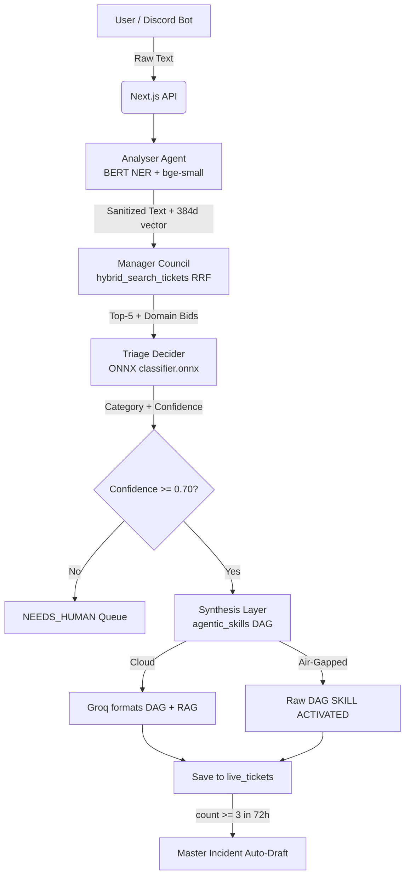
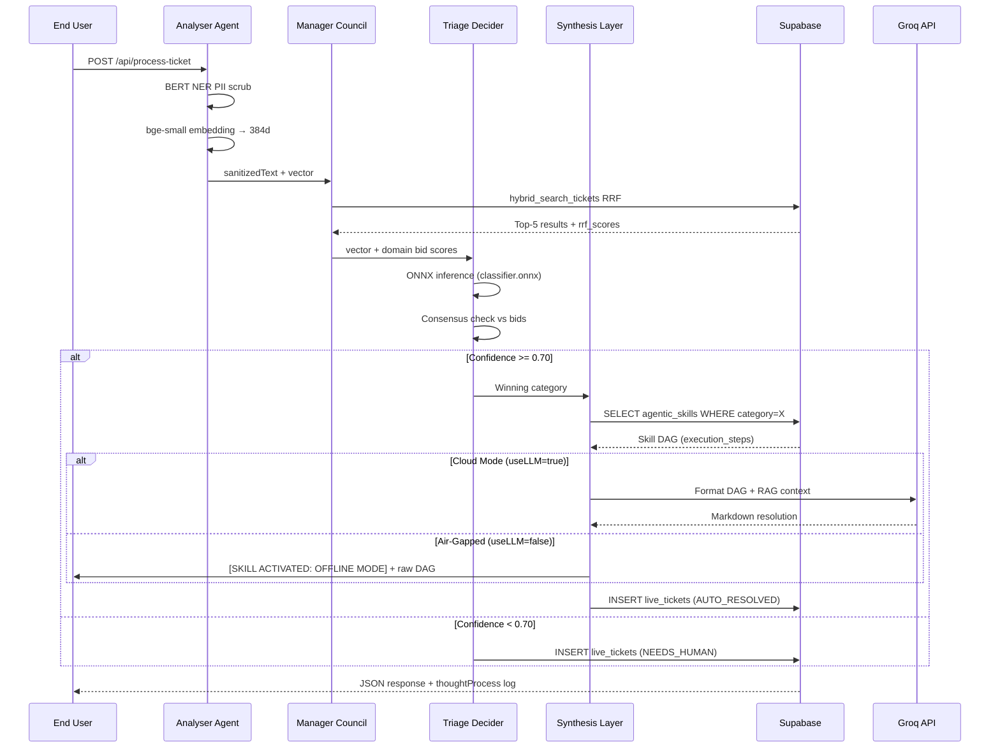
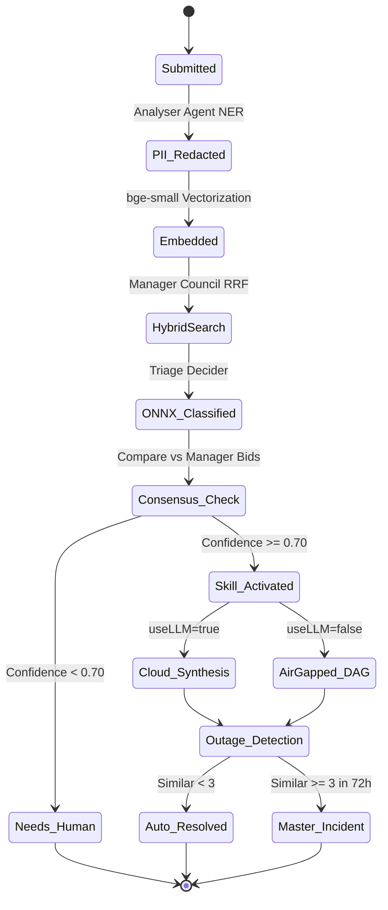

# Captain Obvious: Project Architecture & Design Documentation
### Multi-Agent Council Architecture · Triangle-Edge Synthesis v2.0

---

## 1. Detailed Proposed Solution Architecture & Components

This project implements a **Zero-Trust Agentic IT Helpdesk** built on a Multi-Agent "Council" system. Unlike traditional linear pipelines where a single ML model classifies a ticket and hands off to an LLM, this architecture uses four specialised agents that negotiate — forming a triangle-edge of checks and consensus — before any resolution is served.

### The Three Operational Layers

**Layer 1 — Edge Compute (Analyser Agent)**
Built on Next.js 16, the Analyser Agent intercepts all raw user input. It runs a local BERT NER model (via `@xenova/transformers` WASM) to redact PII (names, IPs, emails, phones) before any data leaves the server. A `bge-small-en-v1.5` embedding model then converts the sanitized text into a 384-dimensional float vector. Both models run entirely in-process — zero external requests, zero data leakage.

**Layer 2 — Retrieval & Classification (Manager Council + Triage Decider)**
The Manager Council calls the `hybrid_search_tickets` Supabase RPC, which fuses BM25 lexical ranking with pgvector cosine similarity using Reciprocal Rank Fusion (k=60). It aggregates results by domain to produce "bid scores" — a measure of how strongly the historical database associates the query with each category.

Independently, the Triage Decider loads `classifier.onnx` via `onnxruntime-web` (a WASM-based runtime) and runs inference directly on the 384d vector. The ONNX output (probability distribution over 6 categories) is compared against the Manager Council's bid scores. If they agree, confidence is high. If they disagree, the ONNX score takes authority (it is the more rigorous signal). A 0.70 confidence threshold gates autonomous resolution.

**Layer 3 — Synthesis (Synthesis Layer)**
When the Triage Decider approves a category, the Synthesis Layer queries the `agentic_skills` table for the matching procedural Skill DAG — a deterministic, multi-step runbook. In **Cloud Mode**, Groq (`llama-3.3-70b-versatile`) formats this DAG into natural language, constrained to the skill steps and RAG context. In **Air-Gapped Mode**, the raw Skill DAG is returned immediately with a `[SKILL ACTIVATED: OFFLINE MODE]` badge — no LLM required.

---

## 2. Low Level Design (LLD)

### Core API Orchestration (`POST /api/process-ticket`)

| Step | Agent | Action |
|------|-------|--------|
| 1 | — | Rate limit check (Upstash Redis sliding window, 5 req/min) |
| 2 | **Analyser** | Local BERT NER PII redaction → regex safety net |
| 3 | **Analyser** | `bge-small-en-v1.5` → 384d embedding |
| 4 | **Manager Council** | `hybrid_search_tickets` RRF (BM25 + pgvector, k=60) → top-5 results + domain bid scores |
| 5 | **Triage Decider** | ONNX `classifier.onnx` inference → category + confidence |
| 5a | — | Consensus check: ONNX vs Manager bids |
| 5b | — | Confidence ≥ 0.70? → proceed; else → NEEDS_HUMAN |
| 6 | **Synthesis** | Load Skill DAG from `agentic_skills` table |
| 6a | — | Cloud: Groq formats DAG + RAG context |
| 6b | — | Air-Gapped: raw DAG returned with `[SKILL ACTIVATED: OFFLINE MODE]` |
| 7 | — | Agentic outage detection: `count_similar_live_tickets_vector` (72h window) |
| 8 | — | Save to `live_tickets`; trigger `master_incidents` if ≥3 similar |

### Fallback Chain

```
ONNX fails          →  JSON LR weights (matrix math, always available)
Embeddings fail     →  Groq unified call (classifies + resolves in one shot)
Fully offline       →  BM25 keyword search + agentic_skills Skill DAG
```

---

## 3. Data Sources & Data Engineering

**Primary Dataset:** 1,304 unique synthetic enterprise IT tickets across 6 categories.

**Pipeline:**
1. Zero-shot generation via `llama-3.3-70b` with parameterized prompts
2. CSV parsing with custom newline-escaping for embedded runbooks
3. `SentenceTransformers (bge-small-en-v1.5)` embedding → normalized float arrays
4. Batch upsert into Supabase `historical_tickets` (includes `embedding vector(384)`)
5. `train_lr.py` trains `LogisticRegression(C=100.0)` → exports **both** `lr_model.json` (JSON fallback) and `classifier.onnx` (primary inference path)

---

## 4. Data Model

```mermaid
erDiagram
    HISTORICAL_TICKETS {
        uuid id PK
        text category
        text sanitized_query
        text resolution_steps
        vector embedding "384 dimensions"
        tsvector sanitized_query_fts "GENERATED for BM25"
    }
    AGENTIC_SKILLS {
        uuid id PK
        text category UNIQUE
        text applicability_logic
        text execution_steps
        text termination_criteria
    }
    LIVE_TICKETS {
        uuid id PK
        text category
        text status "AUTO_RESOLVED | NEEDS_HUMAN"
        text original_redacted_text
        float confidence_score
        int repeat_count
        boolean automation_suggested
        vector embedding
    }
    MASTER_INCIDENTS {
        uuid id PK
        text category
        text incident_summary
        text mass_communication_draft
        text remediation_runbook
        int related_ticket_count
    }
    HISTORICAL_TICKETS ||--o{ LIVE_TICKETS : "RRF Hybrid RAG Context"
    AGENTIC_SKILLS ||--o{ LIVE_TICKETS : "Skill DAG Activation"
    LIVE_TICKETS }|--|| MASTER_INCIDENTS : "Triggers if similar >= 3 in 72h"
```

---

## 5. Data Flow Diagram



---

## 6. Sequence Diagram



---

## 7. State Transition Diagram



---

## 8. Open Source & Library Utilization

| Library | Role |
|---------|------|
| `@xenova/transformers` | WASM BERT NER + bge-small embedding in Node.js |
| `onnxruntime-node` | C++ ONNX runtime for `classifier.onnx` inference |
| `skl2onnx` (Python) | Exports Scikit-Learn LR model to ONNX format |
| `pgvector` | PostgreSQL cosine similarity at DB layer |
| `Scikit-Learn` | Logistic Regression training (C=100.0) |
| `Framer Motion` | Micro-animations and UI state transitions |
| `Next.js 16` | Full-stack React framework with API routes |
| `Upstash Redis` | Serverless sliding-window rate limiting |

---

## 9. Deployment Guide

### Option A — Render (Recommended for ONNX)

Render supports native Node.js binaries. `onnxruntime-node` works without any special configuration.

1. Connect your GitHub repo to Render as a **Web Service**
2. Set **Build Command:** `npm install && npm run build`
3. Set **Start Command:** `npm start`
4. Add all environment variables from `.env.local` in the Render dashboard
5. Ensure `public/models/classifier.onnx` is committed to your repo

### Option B — Vercel

`onnxruntime-node` is a native C++ binary that may exceed Vercel's 50MB function bundle limit. The system **automatically falls back** to JSON LR weights (`data/lr_model.json`) if ONNX fails to load — this is the safe path.

1. Push to GitHub → Import in Vercel dashboard
2. Add all environment variables in Project Settings → Environment Variables
3. Deploy. Vercel will use JSON LR weights; all other features (Hybrid Search, Skill DAGs, Groq synthesis) work fully.

### Database Setup (Both Options)

Run in Supabase SQL Editor, **in order**:
```sql
-- 1. Schema (tables + RRF function + FTS index)
-- Paste contents of supabase/schema.sql

-- 2. Skill DAGs (6 procedural runbooks)
-- Paste contents of supabase/seed_skills.sql
```

### ONNX Model Training (Run Locally Before Deploy)

```bash
pip install scikit-learn sentence-transformers pandas skl2onnx onnxruntime numpy
cd scripts
python train_lr.py
# Outputs:
#   ../data/lr_model.json           (Vercel fallback)
#   ../public/models/classifier.onnx (primary ONNX path)
#   ../public/models/class_map.json  (label decoder)
```

Commit all three output files to your repo before deploying.

---

## 10. Test Cases

| # | Query | Mode | Expected Behavior |
|---|-------|------|-------------------|
| 1 | "PostgreSQL deadlock on payroll query" | Cloud | ONNX → Database (>70%), Manager confirms, Groq formats Skill DAG |
| 2 | "VPN keeps disconnecting" | Air-Gapped | ONNX → Network, `[SKILL ACTIVATED: OFFLINE MODE]` badge |
| 3 | "My keyboard feels weird at the company picnic" | Cloud | ONNX confidence <70% → NEEDS_HUMAN |
| 4 | "VPN crash" × 3 submissions | Cloud | 3rd triggers Master Incident auto-draft |
| 5 | "Outlook crashes with error 0x8004010F" | Air-Gapped | ONNX → Application, raw Skill DAG returned |
| 6 | Any query, embeddings down | Cloud | Groq Path B: unified classification + resolution |
