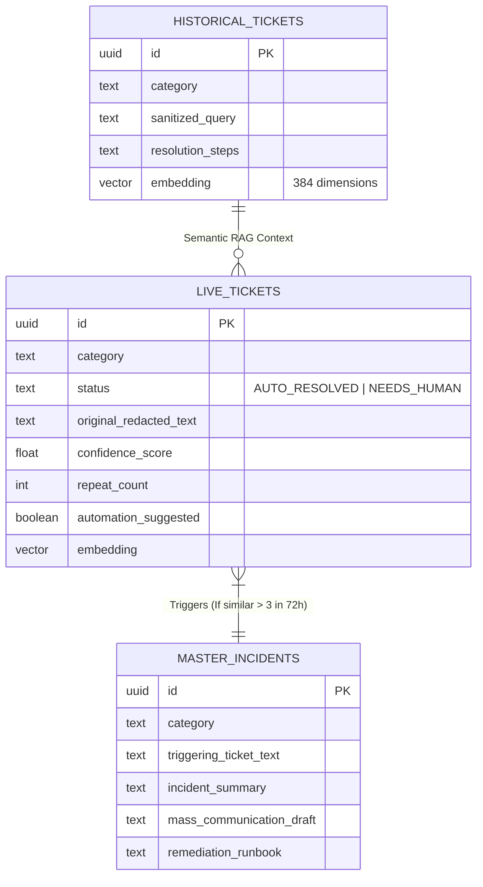
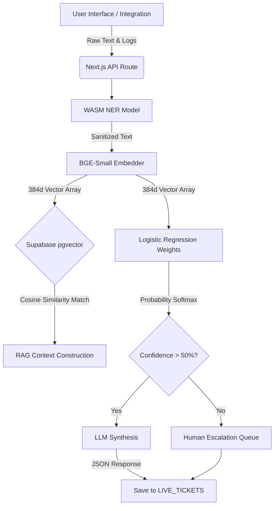
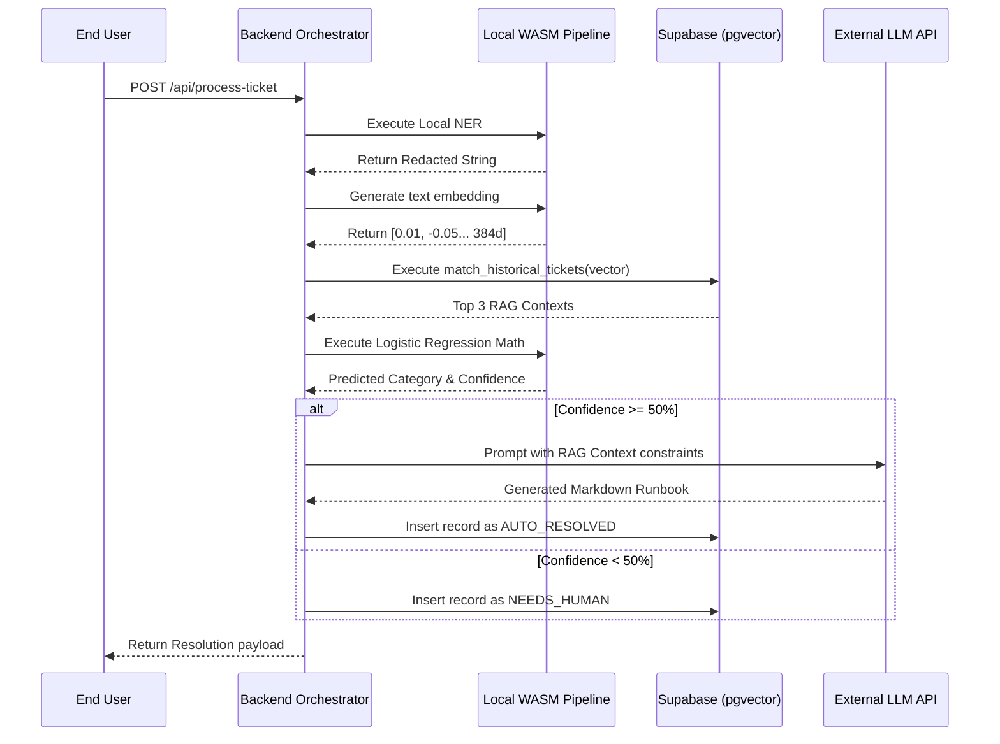
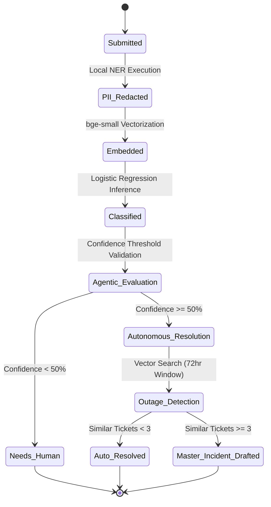

# Captain Obvious: Project Architecture & Design Documentation

## 1. Detailed Proposed Solution Architecture & Components
This project implements a **Zero-Trust Agentic IT Helpdesk**, engineered to automate Level-1 (L1) support triage while adhering to strict enterprise data privacy protocols and offline availability requirements.

The architecture is divided into three distinct operational layers:

1. **The Edge Compute Layer (Client/API):**
   Built on Next.js 14, this layer intercepts raw user input from the frontend or third-party integrations (e.g., Discord). Prior to any external API transmission, the system executes embedded WebAssembly (WASM) models via `Xenova/transformers.js`. It performs Local Named Entity Recognition (NER) using `bert-base-NER` to detect and scrub Personally Identifiable Information (PII) such as IP addresses, names, and credentials. Following redaction, it generates a 384-dimensional text embedding locally using the `bge-small-en-v1.5` model.
   
2. **The Intelligence Routing Layer:**
   A custom-trained Logistic Regression Classifier (optimized with C=100.0 for sharper probability distributions) evaluates the local vector embeddings. This inference is performed natively within the Node.js backend using direct matrix multiplication, eliminating the need for an external Python inference server. If the classifier's confidence score falls below a calibrated threshold (`< 50%`), the system halts autonomous resolution and routes the ticket to a human engineering queue, strictly preventing LLM hallucinations.

3. **The Autonomous Synthesis Layer:**
   When confidence requirements are met, the vector embedding is queried against a `pgvector` enabled Supabase PostgreSQL database using Cosine Similarity (`<=>`). 
   - **Cloud Mode:** The system retrieves the top 3 historical matching contexts and prompts a Large Language Model (`Groq llama-3.3-70b-versatile`) to synthesize a natural language runbook strictly constrained to the retrieved context.
   - **Air-Gapped Mode:** In the event of network isolation or API failure, the system falls back to a deterministic protocol, returning the exact `#1` historical resolution text mapped in the vector space, ensuring zero downtime.

## 2. Low Level Design (LLD)
### Core API Orchestration (`POST /api/process-ticket`)
- **Step 1:** Request validation and Upstash Redis sliding-window rate limiting.
- **Step 2:** PII Scrubbing. The payload is processed by the local WASM NER model. If WASM execution fails, it gracefully falls back to Regex-based pattern matching.
- **Step 3:** Vectorization. The sanitized string is embedded into a `[384]` float array.
- **Step 4:** Database Query. The Next.js API calls the `match_historical_tickets` RPC on Supabase.
- **Step 5:** Inference. The embedding array is multiplied against the `lr_model.json` coefficient matrix. A Softmax function yields the final category and confidence score.
- **Step 6:** LLM Synthesis. If Confidence `>= 0.50` and the system is cloud-connected, the LLM generates a JSON-structured runbook.
- **Step 7:** Anomaly Detection. The system invokes the `count_similar_live_tickets_vector` RPC. If `count >= 3` within the past 72 hours, an autonomous Agentic routine drafts a Master Incident Outage Report and suspends standard L1 responses.

## 3. Data Sources & Data Engineering Steps
**Primary Data Source:** 
The system relies on a proprietary synthetic dataset comprising **1,304 unique enterprise IT support tickets**. This dataset includes highly technical infrastructure issues (e.g., BGP route failures, Docker CrashLoops) as well as generalized, non-technical issues (e.g., password resets).

**Data Engineering Pipeline:**
1. **Data Generation:** Parameterized zero-shot prompting using `llama-3.3-70b` generates high-variance JSON arrays of hypothetical IT issues.
2. **Data Cleaning:** Scripts parse the JSON into strict CSV formats, implementing custom escaping algorithms to prevent pandas tokenization errors caused by embedded newlines in resolution runbooks.
3. **Feature Extraction:** A Python-based pipeline utilizes `SentenceTransformers` to convert the concatenated `title + description` of each ticket into normalized float arrays.
4. **Vector Database Seeding:** A Node.js migration script chunks the 1,304 rows and executes batch inserts directly into the Supabase `historical_tickets` table via the `@supabase/supabase-js` client.

## 4. Data Model (Entity Relationship Diagram)

## 5. Data Flow Diagram (DFD)

## 6. Sequence Diagram

## 7. State Transition Diagram

## 8. Open Source and Library Utilization
- **Transformers.js (Xenova):** Enables the execution of HuggingFace models (`bert-base-NER`, `bge-small`) natively within the browser and Node.js environments via WebAssembly, facilitating zero-trust data processing.
- **Scikit-Learn & Pandas:** Utilized for local data engineering, exploratory data analysis, and deriving the optimized Logistic Regression coefficients.
- **pgvector:** Open-source PostgreSQL extension handling high-performance vector operations and Cosine Similarity calculations at the database layer.
- **Framer Motion:** Open-source animation library for React used to construct complex micro-interactions and the dynamic UI state transitions.
- **Next.js & TailwindCSS:** The core open-source frameworks powering the frontend delivery, backend API routing, and utility-first styling.

## 11. Example Issues to Test in the Web UI

You can copy and paste the following examples directly into the **"Issue Description"** box in the UI to evaluate the system's capabilities:

### Test Case 1: The High-Confidence Auto-Resolve (Database Category)
*Proves the PII Redaction WebAssembly and Local Logistic Regression are perfectly calibrated to Auto-Resolve.*
> "My name is Sarah Connor, my IP is 10.45.2.1, and the production PostgreSQL database is throwing deadlock errors when I try to run the monthly payroll query."

### Test Case 2: The Agentic Master Incident Trigger (Network Category)
*Proves the AI acts autonomously. **Submit this exact same message 3 or 4 times in a row.***
> "The VPN is down! I am working remotely and my Cisco AnyConnect keeps failing to authenticate."
*(On the 3rd or 4th attempt, the Agentic Layer will halt the pipeline and automatically draft a Master Incident Runbook in the logs).*

### Test Case 3: The "Air-Gapped" Offline Fallback (Application Category)
*Proves fault tolerance. **Flip your UI switch to "Air-Gapped / Offline" and submit this:***
> "I cannot open Microsoft Outlook. Every time I click the app, it instantly crashes and throws an Error Code 0x8004010F."
*(The pipeline will execute instantly without touching the Groq API, retrieving the #1 exact vector match).*

### Test Case 4: The Confused User (Low Confidence Escalate)
*Proves the system is smart enough to know what it doesn't know, preventing hallucinations.*
> "My keyboard feels weird and sometimes the screen gets slightly brighter when I open a PDF about the company picnic."
*(The math won't map perfectly to any specific IT vector, dropping confidence below 50%, instantly routing to the NEEDS_HUMAN queue).*
